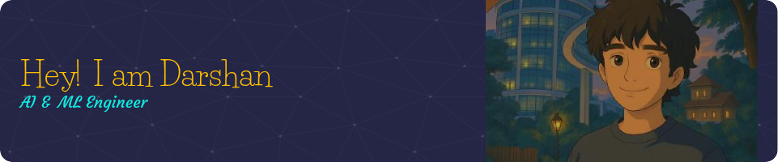

<!-- 🌟 Banner (replace with your image or upload ./banner.png) -->

  

<h1 align="center">Hi 👋, I'm Darshan BR</h1>

  

---

## 💡 About Me

- 🤖 Building future-ready AI systems powered by **LLMs + Agentic AI**
- 🎯 Exploring **LangChain**, **LangGraph**, **CrewAI**, and **Model Context Protocol**
- 🗣️ Developing emotional TTS/STT models with custom datasets
- 🔬 Fine-tuning **Phi**, **Qwen**, **DeepSeek**, and more
- 💼 Looking for roles in **AI Engineering**, **Agentic Dev**, and **LLM R&D**

---

## 🛠️ Tech Stack

  

---

## 🏆 GitHub Trophies

  

---

## 📊 GitHub Stats

  
  

---

## ⌛ Weekly Coding Stats (via WakaTime)

  

---

## 📈 GitHub Summary Metrics

  

---

---

## 👁️ Profile Views

  

---

## 📬 Connect with Me

  
  
  

---

> _“Stay curious. Stay building. The future is agentic.”_

